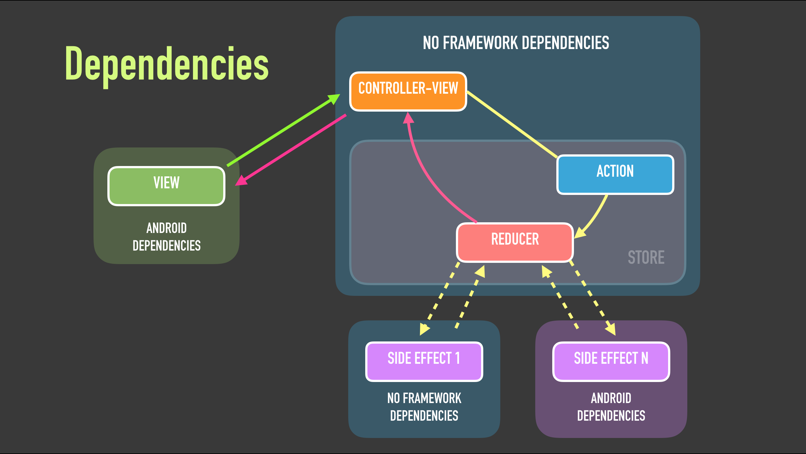

# KUnidirectional 

A sample app that shows how we can apply **unidirectional data flow architecture** on **Android** using **Kotlin**.

# Motivation

This app comes up as a support material for my talk **Unidirectional data flow architecture on Android using Kotlin**.

Talking about architecture is always tough, so as for support for the talk and slides that I created, I decided to create an app where I show what I explain in the talk/slides, so is easier to understand everything; and *getting your hands dirty* is always fun!

# Slides

The slides of the talk can be found [here](https://speakerdeck.com/cesarvaliente/unidirectional-data-flow-on-android-using-kotlin).

# Blog post series

I've written a blog post series explaining the details of this architecture:
- [Part 1](https://proandroiddev.com/unidirectional-data-flow-on-android-the-blog-post-part-1-cadcf88c72f5)
- [Part 2](https://proandroiddev.com/unidirectional-data-flow-on-android-the-blog-post-part-2-b8cfedb1265a)
- [Part 3](https://proandroiddev.com/unidirectional-data-flow-on-android-using-kotlin-the-blog-post-part-3-9ae465e44afa)

# Tell me more!

Our approach is based on [Redux](https://github.com/reactjs/redux) and [Flux](https://facebook.github.io/flux/) from Facebook (that are pretty popular unidirectional data flow approaches on Web), but slightly different, taking things from each one to work on the way we want.

Why the *K* ? because we use [Kotlin](http://kotlinlang.org/) as the programming language, apart from being such a nice and enjoyable language, we take advantage of the really great features this language provide us for building our app.

I wanted to keep this app simple enough so we can understand what we want to learn and is important here, that is just *unidirectional data flow*. Adding libraries that can help us but have their own principles and learning curve could distract us from our real problem here and make, probably, much more difficult to understand it, so for that reason I decided to go without other libraries and implement everything just using Kotlin code; of course we have *kotlin libraries* that helps us to work with Kotlin on Android, and test libraries to help us when testing, but apart of that, no libraries, just pure Kotlin code :blush:

# Requirements

For a much deeper and better understanding of what we are going to explain here with this document and the code, I deeply encourage you to read the official documentation of [Flux](https://facebook.github.io/flux/) and [Redux](https://github.com/reactjs/redux) before.

# What does this app do?

This app is a simple *Items list app*, where we can create, edit and delete Items.
Items are shown in a list where they can be reordered, deleted and set as favorites.
In the edit screen, we can create and edit Items, we can change text and color.

Ok, this is a simple app what is the magic here? Every action in the app follows an **unidirectional data flow**.

When we click on the button to add a new Item and we navigate to the edit item, when we change the Item's color, when we update the item, when we reorder items, etc. everything follows an unidirectional data flow.

# Do you want to see first how does this app look and what it does?

Sure! here you have some screenshots that show basically what we can do with the app:

![Empty Items list][1]
![Create/Edit Item][2]
![Item created][3]
![Edit item (color changed)][4]
![Item updated (color changed)][5]
![Item starred][6]
![Items list][7]
![Item deleted][8]
![Persistence menu][9]

[1]: ./art/screenshots/empty_list.png
[2]: ./art/screenshots/edit_item.png
[3]: ./art/screenshots/item_creted_white.png
[4]: ./art/screenshots/update_item_red.png
[5]: ./art/screenshots/item_updated_red.png
[6]: ./art/screenshots/item_starred_red.png
[7]: ./art/screenshots/items_list.png
[8]: ./art/screenshots/item_deleted.png
[9]: ./art/screenshots/persistence_menu.png

(You can also reorder items but I was not able to take a screenshot during the process :innocent:)

# Are you following this approach on a real app?

Yes we do, I work in a small team inside [One Note](https://www.onenote.com/) at [Microsoft](https://microsoft.com/) and we are following this architecture on the project that I'm working right now on all platforms :smile:

# umm ok, why?

If you are reading this probably you make software, independently of the platform, you make software. 

When has been the last time that you have been working on a multi-platform product, with different teams that work on each platform dealing each one of you with the same features, same problems,.. and then.. going to a meeting, talking to a colleague from other team about how they do *x* and realise that:

1. Both of you use completely different languages, and I'm not talking about programming languages, but vocabulary, terms, etc.  you sometimes think: *"mate, no idea of what you are talking about"*
2. Both of you are approaching to exactly the same problem in completely different ways.
3. *Do you want to have a look at my code? yes sure!* but here the problem is not that maybe you don't know the programming language, or the framework used, or libraries, is that the architecture of the app, the components, the modules, are completely different than the ones you are used to.
4. Bugs, of course, we always have bugs, but hey, we have the same product, just on different platforms and you have completely different bugs on the same features, and when you try to help or ask for help .... *we go then to the point 1*... and again and again :confounded:

We know it, we know that pain, how it feels, and we wanted to avoid that if possible; we wanted:
1. To have a common language, and again, not talking about programming languages, but vocabulary, terms, etc.
2. To have a similar way to approach the same problem.
3. To have the same structure in all our apps, the same components, the same way to work, at the end, the same architecture.
4. To help and be helped!
5. To work/help on another platform without the feeling that you really don't know where to start working nor what to do.

Having the same architecture on all our platforms, make our talks between clients amazing, we all are in the same boat, we know how to drive that boat and how to improve it, all of us.

And of course, we take advantage of all of the benefits of an unidirectional data flow architecture, but [here](http://redux.js.org/docs/basics/DataFlow.html#data-flow) the team from Redux explain it much better :wink:

# is this code part of a real app?
Nope, this code is inspired by what we do and how we do, but is much simpler, so that's better for educational purposes like we have here :wink:

# Architecture of KUnidirectional

I think an image is more valid than 1000 words:

# Modules and components

This app has three modules and three main components:
* **App** is the module where our *views* live, it has the components that the user interacts with.
  Also contains [**ControllerView**](https://facebook.github.io/flux/docs/in-depth-overview.html#views-and-controller-views) that acts between views and everything else.
  If you are used to MVP pattern, they are very similar to *presenters*, so they help us to decouple the logic of our business from the view/framework. 
  We are going to see later the other different components, but basically what the ControllerView does is being subscribed to *State* changes, creates an *Action* after the user interacts with the View (the View has a ControllerView), *dispatches the action*, and later, when it receives a new state, communicate back to its view so the view can react to the new state and render itself.

* [**Store**](http://redux.js.org/docs/basics/Store.html) is the main module of our app, our business logic resides there.
 If you are coming from Clean Architecture, **Store is our Domain**. The store has several and important components:
    1. [**Actions**](https://redux.js.org/basics/actions) they are simple elements which indicate what we want to do, what we want to achieve.
     For instance *CreateItem* is an action, *DeleteItem* is another action, and so on.
      They can have parameters, for instance when we create an item we have to indicate its text and color, when we delete an item we have to indicate its localId so we can delete it, etc.
      We have actions grouped as [sealed classes](https://kotlinlang.org/docs/reference/sealed-classes.html) so later when we handle them is much easier to do it.
    2. [**State**](https://redux.js.org/introduction/core-concepts) this entity has everything that we need to use, is a simple and immutable data structure.
      For instance in the list items, we have the items we have to show to the user, in the edit item screen, we have what the current item has, etc.
    3. [**Dispatcher**](https://facebook.github.io/flux/docs/dispatcher.html#content) is used to *dispatch* Actions or a new State.
      Dispatcher can be implemented in many ways, as a simple function, as a class with a list of subscribers, using external libraries that follow an event/subscriber pattern or others that follow observer pattern, etc.
     In our approach we wanted to keep the app simple without 3rd party dependencies that make understanding this architecture more complicated, and we have opted for a simple function that lives in the store, so then we can dispatch actions or new states directly from the store just invoking the function.
    4. [**Reducers**](https://redux.js.org/basics/reducers) are pure functions that given an action and the current state of the app, apply this action to that state, and generate a completely new state (remember, a state is an immutable object). The logic of what we have to do resides here, for instance, when we want to create an item we do:
        - Create *CreateItemAction(id, text, color)*
        - Dispatch the action
        - Reducers take that action and apply it to the current State.
        - We have then a new state, that contains this new item in its list.

 * **Persistence** is a side effect. Ok, first, what a side effect is?
    Side effects are optional and are used to enrich and extend the functionality of our app. For instance, in our case, the store and the state live in the memory, the data is never persisted physically, nor in a DB nor in a file, etc.
 How can add persistence to our architecture? the response is side effects. Side effects add extra functionality, like in our case persistence in a DB.
  A side effect runs after the main operation has been done, in our case, a side effect is a process that is going to run after our store has reduced an action together with the current state. Once that the store has reduced the action, is going to dispatch that action (the same) to its side effects (that are subscribed to it) if any.
  Side effects will run completely separated and isolated from each other and from the rest of the world.
  Side effects once that have finished handling the Action, can dispatch a new and a different action to the store, then the store will reduce that new action together with the current state.
   For instance when we fetch data from the DB, is the perfect scenario where we send a new action with the new items that we have fetched. 
 A pretty cool thing of side effects is that we can *"enable or disable"* them, as you can see in [this video that I've uploaded](https://goo.gl/c2ueJC) where we enable and disable the persistence side effect and the app works without any problem (of course when is disabled we don't have DB persistence). This is because, at the end, a side effect is subscribed to handle an action after the store has reduced it, if is not subscribed to the store then it won't handle actions, but that's all, our app should be able to work without it (of course, in many cases, side effects are essential, think in a DB, a sync layer, etc.).
   Btw in this sample app we use [Realm](https://realm.io/) as DB, mainly because I wanted to experiment with it and because is really easy to build a small DB with a simple scheme and operations, but we could replace this DB for another really easily (the good thing about having everything decoupled).

# Threading

Threading is really important in Android, we never want to block the UI thread when we do other stuff that is not UI related, we always want to give the best possible user experience to our users so what we do is:

- **View** it runs in the main (UI) thread.
- **Store** it runs in its own *store thread*
- **Side effects** (in our case just persistence) they run in their own *side effect thread*, if we have many each side effect will run in its own thread in an isolated way.

Of course when testing, dealing with threads is a nightmare, so we have mechanisms in the app to execute everything in the main thread in that case (DI FTW).

# Dependencies

We want to have a good architecture that its components are decoupled from each other, so we can have our business logic completely independent from frameworks, we can test each component in an isolated way, we can unit test without the need of work on instrumentation tests that are slow, etc.
  This is key in Clean architecture, and this approach (and Redux and Flux) follow that too. Of course, you can mess everything, but if you want (and you should), you can have your components decoupled and isolated so they are easier to maintain, to test, to extend, etc.

A diagram of the dependencies of the different components of our architecture is:

As we can see:
- **View** has Android related framework dependencies.
- **ControllerView** and **Store** (remember, actions, dispatcher and reducers belong to the Store), don't have framework dependencies, just pure Kotlin stuff.
- **Side effect** we can have a side effect that doesn't have framework dependencies like a network layer, or with dependencies, for instance, a DB where usually in Android we need the *Context*.

# Testing

Now that we know the dependencies of our different components we can say how we can test them:
- **View** here we should have instrumentation/UI tests that test that our interactions have gone well, and what the user sees and expects is correct. I haven't implemented UI tests in this sample app since I wanted to focus more on the rest of the tests and components.
- **ControllerView** since it doesn't have Android framework related dependencies we can completely unit test it.   One cool thing of our *ControllerViews* is that is the perfect place to have our integration tests since they create an action and receive a new state, *we can test that the expected state after dispatch that action is what it should have*.
- **Store** we can completely unit test the different components of the store, remember we don't have framework dependencies in our core (dispatchers, reducers, state, etc).
- **Side effect** it depends on if it has framework dependencies or not, but in our sample app that we have a persistence side effect that needs the Android context, we can use instrumentation test for the classes that use framework dependencies (DB functions) or unit test for the classes that don't have dependencies (mappers).

# Problems?

Of course, we have, this is not the *Philosopher's Stone of the architectures*, and as any other architecture, we have issues, difficult things to do and to improve, problems to solve, etc.
  For instance, a list of things that we have not covered here (nor in the slides) but are really important:
 
- Several actions that run always one after the other in some cases but not always.
- How can we cancel actions from being reduced (or applied) when we already know that are not needed anymore (so we don't waste resources)?
- How can we deal with too much information (memory allocation) in our State so we don't keep a reference to everything in our app?
- How can we improve the navigation stack of our app/state?
- etc.
   Of course, all these things can be fixed, and there are different and valid ways to do it, but how you want to do it is your decision :wink:

# More info?

We already have referenced to useful links and documentation through the whole document, but here is a list of really awesome and useful references that you can have a look to understand even better, what I've tried to explain here, with the talk, the slides, and the code:

- [Flux](https://facebook.github.io/flux/)
- [Redux](http://redux.js.org/)
- [Luis G. Valle: Flux on Android](https://github.com/lgvalle/android-flux-todo-app)
- [André Staltz: Unidirectional data flow architectures](https://www.youtube.com/watch?v=1c6XiQsnh_U)
- [Austin Mueller: Flux and Android](http://armueller.github.io/android/2015/03/29/flux-and-android.html)
- [Brian Egan and Guillaume Lung: Exploring the possibilities of Unidirectional Data Flow Architectures on Android](https://www.youtube.com/watch?v=SsH_rByBbq4)

I've also uploaded and created some videos that are used in the slides of the presentation to help to understand what is happening under the hood when we interact with the app:

- [KUnidirectional demo videos](https://goo.gl/PIfjr5)

# Contributors

- [César Valiente](https://twitter.com/cesarvaliente)
- [Corey Shaw](https://github.com/coshaw)
- [Sebas LG](https://github.com/sebaslogen)

License
-------------------

This is an open source sample app released under [Apache License v2](http://www.apache.org/licenses/LICENSE-2.0), so it means that you can take the code an use it in your open source projects that use compatible licenses with Apache, but also in your privative ones.

This license requires attribution, so if you are going to use the code, respect the attribution, respect the class headers that mention the license terms and author names, and if you are going to release your app (that uses this code) to the world (the binary, the apk) then create a section in your app where you mention all the libraries your app uses including author names, code licenses, and code source links.

Code of Conduct
-------------------
Even when this code is not a Microsoft product, we have adopted the [Microsoft Open Source Code of Conduct](https://opensource.microsoft.com/codeofconduct/). For more information see the [Code of Conduct FAQ](https://opensource.microsoft.com/codeofconduct/faq/) or contact us with any additional questions or comments.
